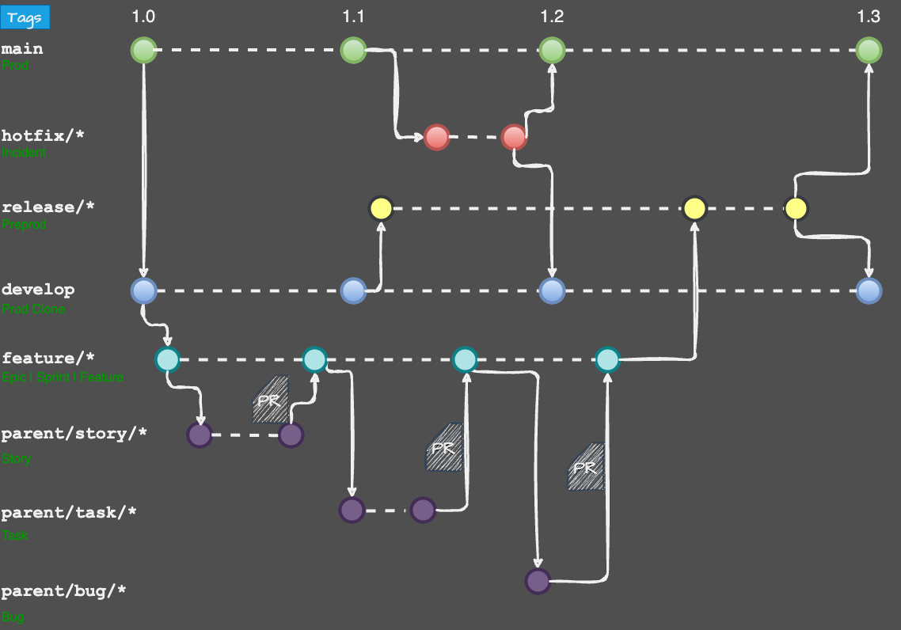

## Alinma Pay Mobile Branching Model Guideline

This guideline outlines the process for contributing code to our project using Alinma pay Git branching model. 

**Understanding the Branches:**

* **main:** This branch holds the **released, stable** version of the code. **Only merges** from the latest release branch.
* **develop:** This branch is only a clone from the **main** branch.

**Contribution Workflow:**

1. **Feature Branch:**
    * Each feature branch represents either **Epic or Sprint**.
    * Create a branch with a descriptive name (e.g., `feature/pay-123-description-of-feature`).
    * This branch holds the **released, stable** version of the **Epic** features.
    * **Only merges** from the children **(story, bug, task)** branches and only throw PR. 
2. **Children Branches:**
    * Each Child branch represent either **Story or Task ot Bug**.
    * Follow the following naming conventions for children branches `parent-branch-name/story|task|bug/pay-123-description-of-task` (e.g., `pay-144-cache-management/task/pay-456-build-dashboard-screen`).
    * Implement your changes on these branches.
    * Commit your changes regularly with clear, concise commit messages.
3. **Code Review and Integration:**
    * Once your change is complete, push your branch to the remote repository.
    * Create a pull request from your **Child** branch to its **Parent** branch.
    * Address any feedback or requests for changes from code reviewers.
    * Once approved, your changes will be merged into its **Parent** branch.
4. **Releases:**
    * For production releases, create a branch named `release/pay-5643-description-of-release` from the `develop` branch.
    * Merge desired **Epic feature branches ** in the release branch.
    * Once your merge is complete, push your branch to the remote repository.
    * Deploy the release in the staging environment.
    * Address any bugs or business comments.
    * Create a pull request from the release branch to **both** `main` and `develop` branches.
    * Once approved, the release will be merged into both branches.
5. **Hotfix:**
    * For critical bug fixes that need to be deployed quickly, create a branch named `hotfix/pay-1323-description-of-fix` from the `main` branch.
    * Implement the hotfix and push it to the remote repository.
    * Create a pull request from the hotfix branch to **both** `main` and `develop` branches.
    * Once approved, the hotfix will be merged into both branches.

**Additional Guidelines:**

* **Small, focused branches:** Keep your feature branches small and manageable for easier review and integration.
* **Meaningful commit messages:** Write clear and informative commit messages that describe the changes you made.
* **Testing:** Ensure your changes are well-tested before submitting a pull request.
* **Stay up-to-date:** Regularly pull updates from the remote repository to avoid merge conflicts.

**Branching model visualization:**

